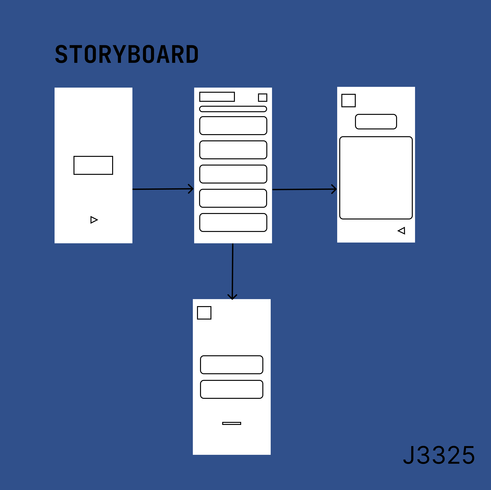
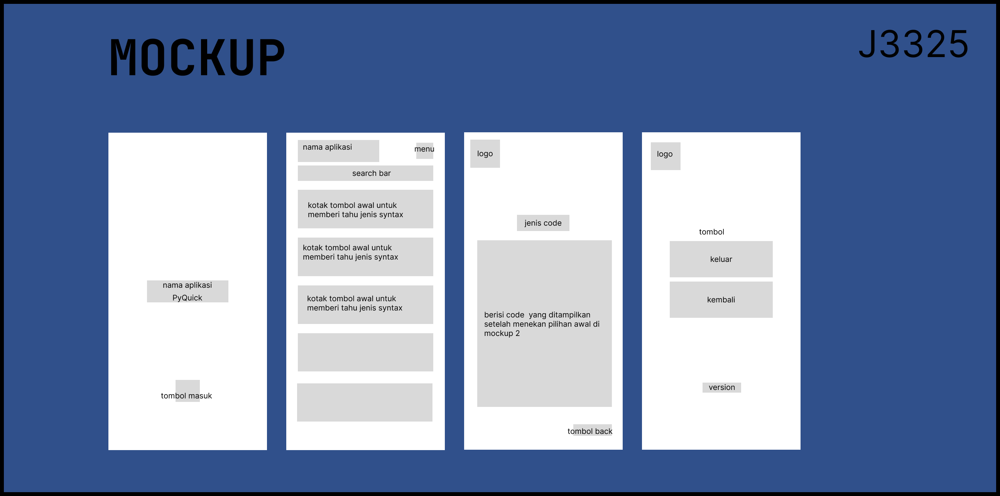
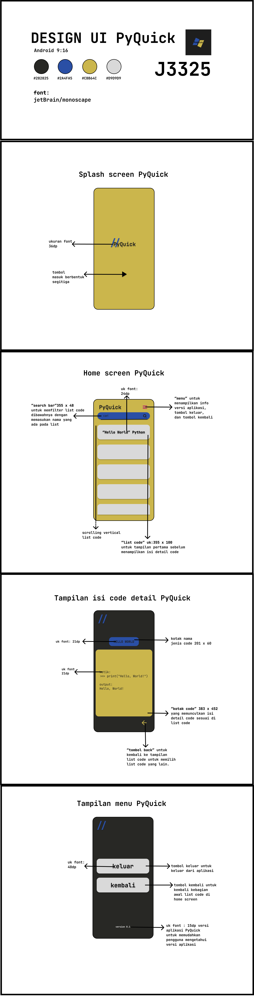

# Projek UAS
# PyQuick
| Keterangan | Data                |
| ---------- | ------------------- |
| **Nama**   | Zaky Putra Pratama |
| **NIM**    | 312310613           |
| **Kelas**  | TI.23.A6            |
#
**`PyQuick`**  
adalah aplikasi `Quick Reference`  
untuk mempermudah pengguna menggunakan dan  
mengetahui code-code python dengan lebih cepat.  
#
## StoryBoard

#
## MockUp

#
## UI Design

